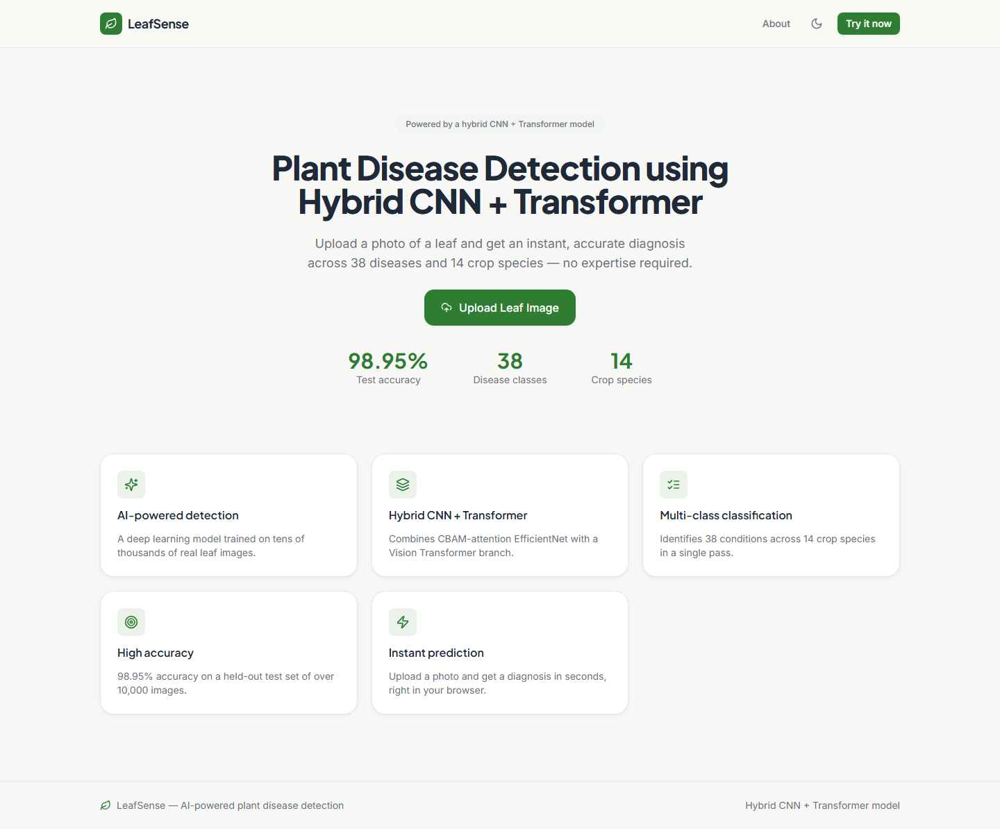
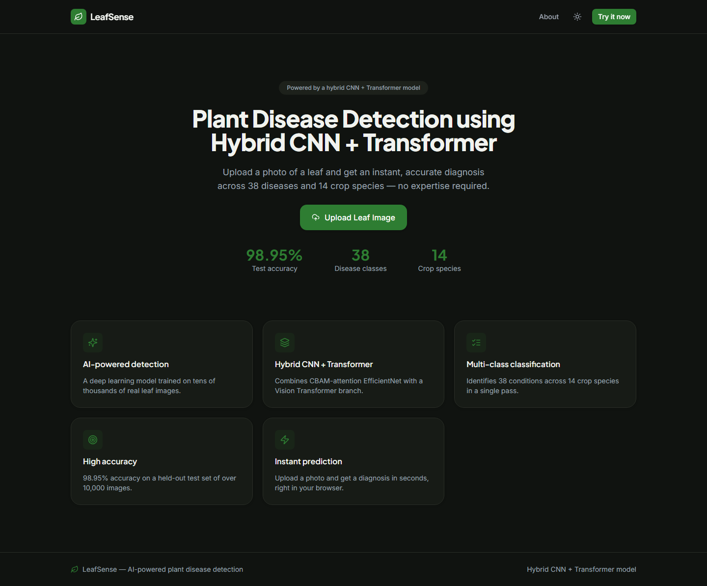
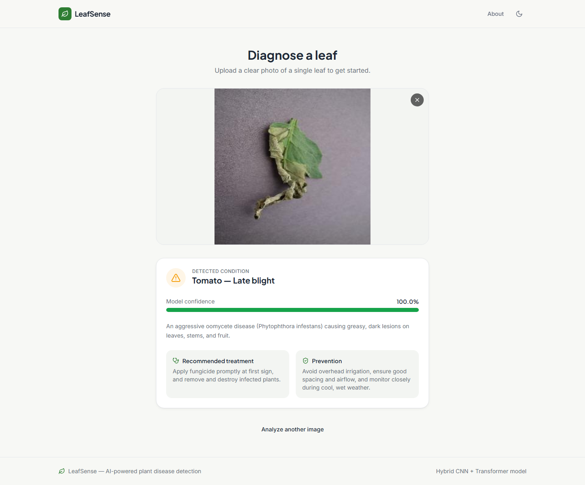
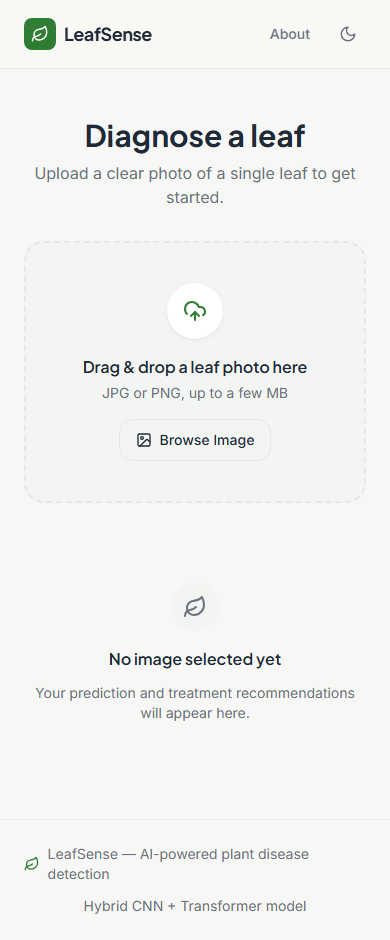
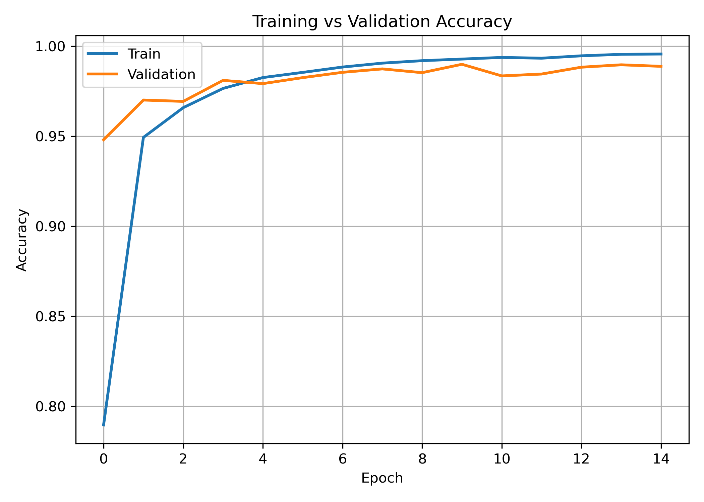
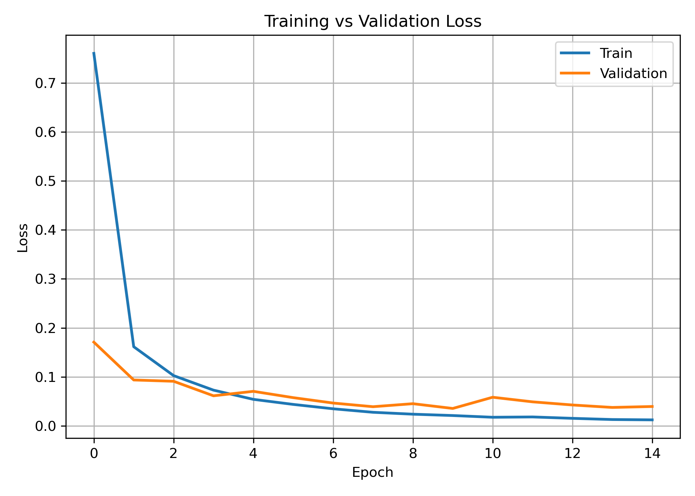
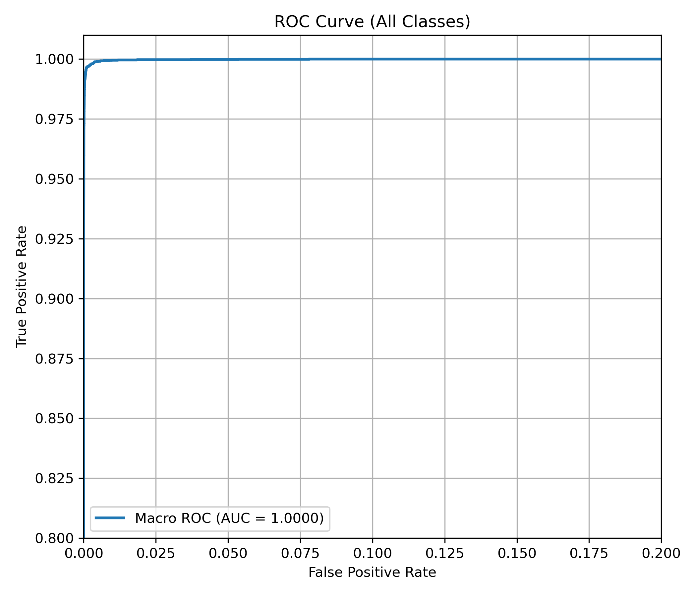
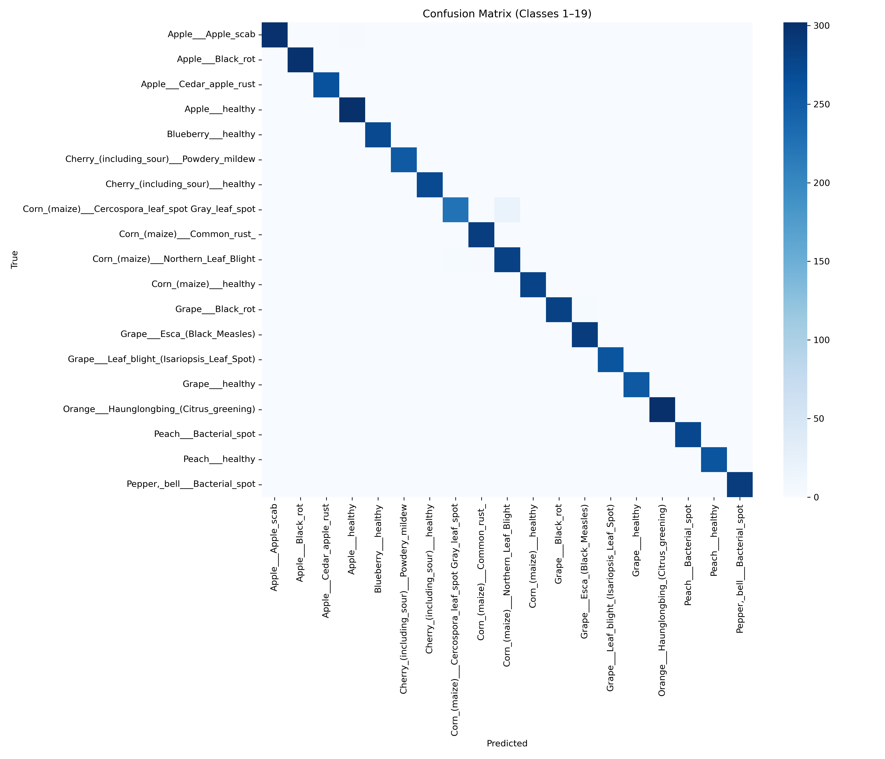
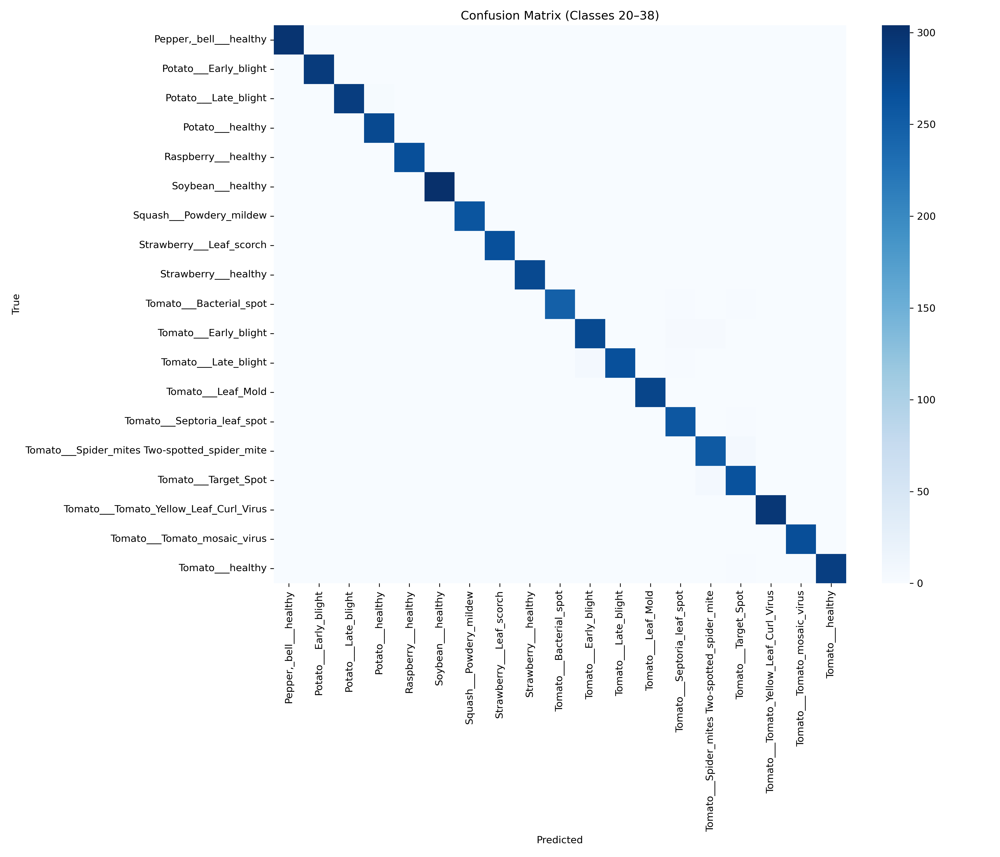

<div align="center">

# LeafSense

### AI-Powered Plant Disease Detection

A hybrid deep learning system that diagnoses plant leaf diseases from a single photo — combining a
CBAM-attention EfficientNetB0 CNN with a custom Vision Transformer, served through a full web application.


**98.95% test accuracy** &nbsp;·&nbsp; **38 disease classes** &nbsp;·&nbsp; **14 crop species**

</div>

---

## Overview

LeafSense classifies plant leaf photos into 38 disease/healthy categories across 14 crop species (Apple,
Blueberry, Cherry, Corn, Grape, Orange, Peach, Pepper, Potato, Raspberry, Soybean, Squash, Strawberry,
Tomato). Upload a photo and get an instant diagnosis, a confidence score, and practical treatment and
prevention guidance — all running on a hybrid CNN + Transformer model trained from scratch on the
"New Plant Diseases Dataset (Augmented)".

## Screenshots

<table>
<tr>
<td></td>
<td></td>
</tr>
<tr>
<td align="center"><sub>Landing page — light mode</sub></td>
<td align="center"><sub>Landing page — dark mode</sub></td>
</tr>
<tr>
<td></td>
<td></td>
</tr>
<tr>
<td align="center"><sub>Prediction result with treatment & prevention</sub></td>
<td align="center"><sub>Responsive mobile layout</sub></td>
</tr>
</table>

## Key Features

- **Hybrid architecture** — CBAM-attention EfficientNetB0 fused with a custom Vision Transformer branch
- **38-class multi-disease classification** across 14 crop species in a single forward pass
- **98.95% test accuracy** on a held-out set of 10,576 images
- **Instant predictions** through a FastAPI backend and a React web UI
- **Treatment & prevention guidance** for every class, not just a raw label
- **Light/dark theme**, persisted across visits
- **Fully responsive**, from desktop down to mobile

## Model Architecture

Two branches operate on the same 224×224×3 input and are fused before classification:

```
                 ┌─────────────────────────┐
                 │   Input image (224²×3)  │
                 └────────────┬────────────┘
                ┌──────────────┴──────────────┐
                ▼                             ▼
   ┌─────────────────────────┐   ┌─────────────────────────┐
   │   CNN branch            │   │   ViT branch             │
   │  EfficientNetB0 (frozen) │   │  16×16 patch embedding   │
   │  → CBAM channel +        │   │  → positional embeddings │
   │    spatial attention     │   │  → 4× transformer blocks │
   │  → GlobalAvgPool         │   │    (MHSA + FFN)          │
   │  → Dense(512)            │   │  → Dense(512)            │
   └────────────┬─────────────┘   └────────────┬─────────────┘
                └──────────────┬───────────────┘
                               ▼
                    Concatenate (1024-d)
                               ▼
                 Dense(1024, relu) → Dropout(0.4)
                               ▼
                  Dense(38, softmax) → prediction
```

Only the CBAM, ViT, and fusion layers are trained; the EfficientNetB0 backbone stays frozen throughout.

## Results

| Accuracy | Loss |
|---|---|
|  |  |

**ROC curve (macro-average)**



**Confusion matrix** (split into two halves for readability — 38 classes)




## Tech Stack

| Layer | Technology |
|---|---|
| Model | TensorFlow / Keras, EfficientNetB0, custom CBAM + Vision Transformer |
| Backend | FastAPI, Uvicorn |
| Frontend | React 18, Tailwind CSS, Framer Motion, Lucide icons, React Router |
| Training | Jupyter Notebook |

## Repository Structure

```
notebooks/   plant_disease_hybrid_model.ipynb — model definition, training, evaluation
models/      cbam_vit_efficientnet_hybrid.h5 — trained weights (gitignored; regenerate via the notebook)
data/        split_dataset/ — train/valid/test images (gitignored; see data/README.md)
results/     confusion matrices, ROC curve, accuracy/loss curves, classification_report.csv
screenshots/ web app screenshots used in this README
frontend/    React web UI for uploading a leaf image and viewing predictions
backend/     FastAPI service that loads the model and serves predictions to the frontend
```

## Getting Started

### 1. Train / use the model

```bash
pip install -r requirements.txt
```

Download the dataset per `data/README.md` so it lands at `data/split_dataset/{train,valid,test}`, then open
`notebooks/plant_disease_hybrid_model.ipynb` in Jupyter and run all cells top-to-bottom from a fresh kernel.
If `models/cbam_vit_efficientnet_hybrid.h5` already exists, the notebook loads it and skips training;
delete/rename it first to force a retrain. Evaluation plots and the classification report are written to
`results/`.

### 2. Run the web app

```bash
cd backend && pip install -r requirements.txt && cp .env.example .env && python main.py
cd frontend && npm install && cp .env.example .env && npm start
```

TensorFlow needs Python 3.9–3.13 — if your system Python is newer (e.g. 3.14), create the backend's venv
with an older interpreter (`py -3.13 -m venv .venv` or similar) before installing requirements.

The backend loads `models/cbam_vit_efficientnet_hybrid.h5` and classifies directly across all 38 classes.
Verified end-to-end: correct predictions across multiple crops in a full browser walkthrough (landing page,
upload, prediction result, light/dark mode, desktop/mobile), matching the notebook's ~98.95% test accuracy.

### Frontend architecture

Two pages, `HomePage` (landing) and `PredictPage` (upload + result), lazy-loaded via `React.lazy`.

- `components/ui/` — generic, reusable primitives (Button, Card, ProgressBar, LoadingSpinner, Toast, Modal,
  EmptyState, ThemeToggle)
- `components/layout/` — Navbar, Footer, AboutModal
- `components/features/` — app-specific pieces (UploadZone, PredictionCard)
- `contexts/` — `ThemeContext` (light/dark, persisted to `localStorage`) and `ToastContext`
- `hooks/useImagePrediction.js` — wraps the upload → predict → result/error state machine
- `services/api.js` — the only place that talks to the backend
- `utils/diseaseInfo.js` — static description/treatment/prevention copy for all 38 classes (the backend
  only returns `{class, confidence}`; this content lives entirely in the frontend)
